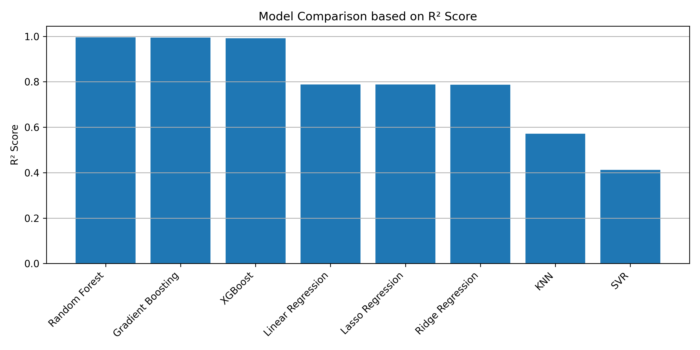
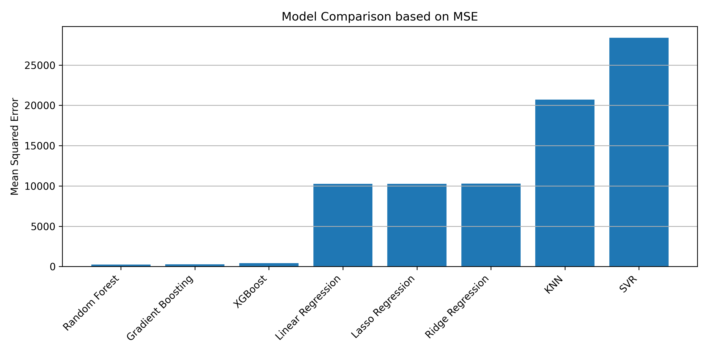
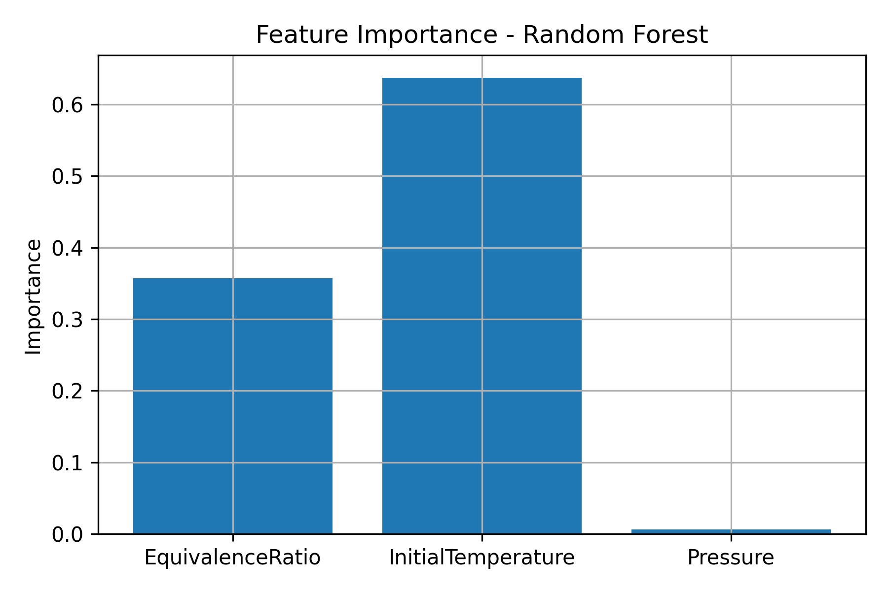

# Data Generation Using Cantera Simulation and Machine Learning Model Comparison

**Name:** Mahim Katiyar  
**Institute:** Thapar Institute of Engineering and Technology  
**Roll Number:** 102303958

---

## Project Overview

This project demonstrates how **physics-based simulation** can be combined with **machine learning** to solve a real-world regression problem.  
The **Cantera** combustion simulator is used to generate synthetic data for methane–air combustion under varying operating conditions.  
The generated dataset is then used to train and compare multiple **machine learning regression models** to predict the **adiabatic flame temperature**.

---

## Simulator Used: Cantera

**Cantera** is an open-source software suite widely used for:
- Chemical kinetics
- Thermodynamics
- Transport processes
- Combustion modeling

### Why Cantera?
- Produces physically accurate combustion simulations
- Widely accepted in research and industry
- Ideal for simulation-based data generation for machine learning

In this project, Cantera is used to simulate **constant-pressure methane–air combustion**.

---

## Simulation Description

### Combustion Setup
- **Fuel:** Methane (CH₄)
- **Oxidizer:** Air (O₂ + 3.76 N₂)
- **Reaction mechanism:** `gri30.yaml`
- **Thermodynamic process:** Constant enthalpy and pressure (HP equilibrium)

### Simulation Output
- **Adiabatic Flame Temperature (K)**

---

## Dataset Generation

### Input Features

| Feature | Description | Range |
|------|------------|-------|
| Equivalence Ratio (ϕ) | Fuel–air ratio | 0.6 – 1.4 |
| Initial Temperature (K) | Temperature before combustion | 300 – 1200 |
| Pressure (atm) | Operating pressure | 1 – 10 |

### Target Variable

| Target | Description |
|------|------------|
| FlameTemperature | Adiabatic flame temperature (K) |

### Dataset Details
- **Number of simulations:** 1000
- **Dataset type:** Synthetic (simulation-based)
- **Machine learning task:** Supervised regression

---

## Machine Learning Problem Definition

The objective of this project is to **predict the adiabatic flame temperature** using machine learning models .

---

## Machine Learning Models Used

The following regression models were trained and evaluated:

1. Linear Regression  
2. Ridge Regression  
3. Lasso Regression  
4. K-Nearest Neighbors (KNN)  
5. Support Vector Regression (SVR) with RBF kernel  
6. Random Forest Regressor  
7. Gradient Boosting Regressor  
8. XGBoost Regressor  

These models include linear, nonlinear, kernel-based, and ensemble learning approaches.

---

## Model Evaluation Metrics

Each model was evaluated using the following metrics:

- **R² Score:** Measures how well the model explains variance in the target variable
- **Mean Squared Error (MSE):** Measures prediction error magnitude

---

## Model Comparison Results

| Model | R² Score | MSE |
|------|--------|------|
| Random Forest | 0.995068592 | 237.9768972 |
| Gradient Boosting | 0.99457117 | 261.9812011 |
| XGBoost | 0.991392431 | 415.378855 |
| Linear Regression | 0.787576651 | 10250.99751 |
| Lasso Regression | 0.787574992 | 10251.0776 |
| Ridge Regression | 0.786799689 | 10288.49168 |
| KNN | 0.571034932 | 20700.73686 |
| SVR | 0.412116019 | 28369.74968 |

---

## R² Score Comparison

The following graph compares all models based on **R² score**, showing how well each model explains the variance in flame temperature.

---

## MSE Comparison

This graph compares the **Mean Squared Error (MSE)** across all models.  
Lower MSE values indicate better prediction accuracy.

---

## Feature Importance (Best Model)

Feature importance extracted from the **Random Forest Regressor** highlights the contribution of each input feature.

### Interpretation
- Initial Temperature has the strongest influence on flame temperature
- Equivalence Ratio significantly affects combustion behavior
- Pressure has a comparatively smaller but noticeable impact

These results align well with combustion physics.

---

## Best Performing Model

- **Best Model:** Random Forest Regressor  
- **Reason:** Highest R² score and lowest MSE  
- **Conclusion:** Tree-based ensemble models effectively capture nonlinear combustion dynamics

---

## Complete Workflow

1. Selection of Cantera as the combustion simulator  
2. Definition of simulation parameters and bounds  
3. Random sampling of input parameters  
4. Execution of 1000 combustion simulations  
5. Dataset construction from simulation outputs  
6. Training of multiple machine learning regression models  
7. Evaluation using R² score and MSE  
8. Model ranking and comparison  
9. Visualization and interpretation of results  

---

## Conclusion

This project demonstrates the effectiveness of combining **simulation-based data generation** with **machine learning**.  
Cantera enables realistic and physics-consistent data generation, while machine learning models efficiently learn complex nonlinear relationships.

Among all evaluated models, the **Random Forest Regressor** achieved the best performance for predicting adiabatic flame temperature.

---

## Technologies Used

- Python  
- Cantera  
- NumPy  
- Pandas  
- Matplotlib  
- Scikit-learn  
- XGBoost  

---

